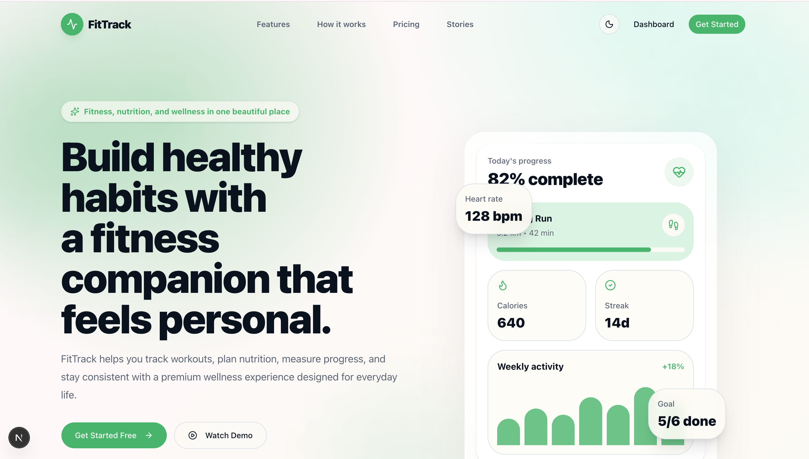
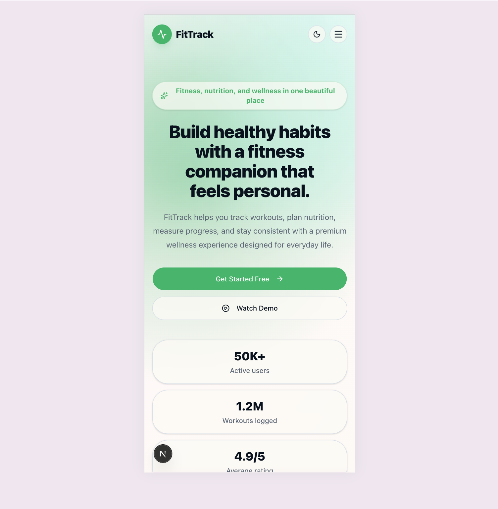
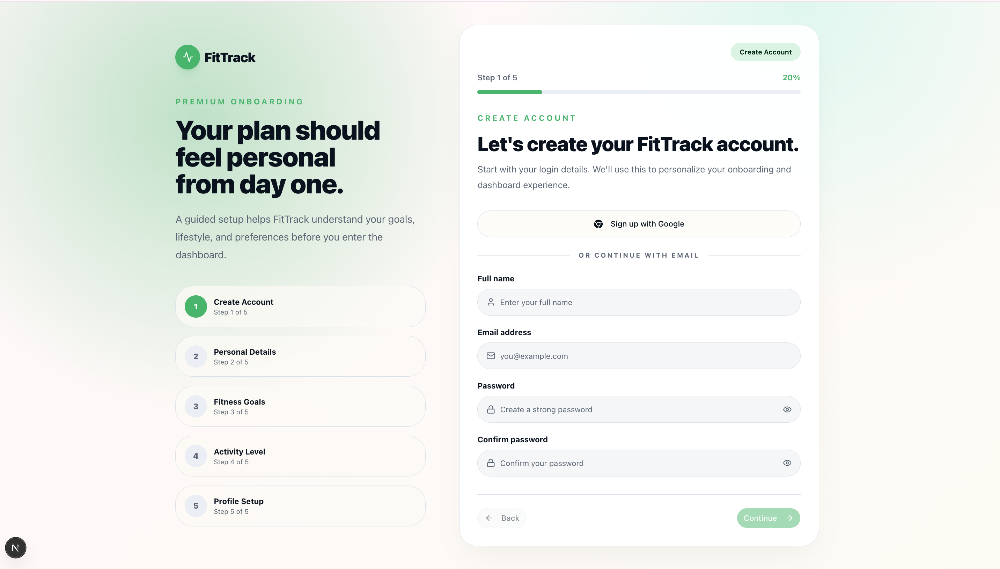
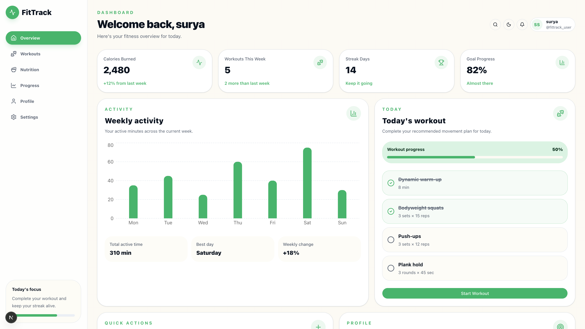

# FitTrack - Fitness & Wellness Platform

FitTrack is a premium fitness and wellness frontend application built as part of a Junior Frontend Developer technical assessment.

The project includes a polished landing page, a 5-step authentication/onboarding flow, and a responsive post-login dashboard using mock/local data.

## Live Demo

Add deployed link here after deployment:

```txt
https://fit-trac.netlify.app/
```

## Screenshots

### Landing Page - Desktop



### Landing Page - Mobile



### Onboarding Flow



### Dashboard



## Features

### Landing Page

- Premium responsive hero section
- Sticky navbar with mobile drawer
- Social proof section
- Feature cards with hover effects
- How-it-works visual flow
- Testimonials
- Pricing cards
- Final CTA section
- Footer
- Smooth animations and micro-interactions

### Onboarding Flow

- 5-step onboarding flow
- Step progress indicator
- Smooth step transitions using Framer Motion
- Real-time validation using React Hook Form and Zod
- Password strength indicator
- Selectable fitness goal cards
- Activity level selection
- Avatar upload preview
- Notification preferences
- Local profile persistence
- Success screen after completion

### Dashboard

- Responsive dashboard layout
- Desktop sidebar navigation
- Mobile bottom navigation
- Welcome header with profile data
- Stats cards
- Workout checklist
- Weekly activity chart
- Quick actions
- Goal summary
- Loading skeletons
- Empty states

## Tech Stack

- Next.js App Router
- TypeScript
- Tailwind CSS
- Shadcn/UI
- Framer Motion
- React Hook Form
- Zod
- Zustand-ready architecture
- Lucide React
- Recharts
- Next.js API Routes
- LocalStorage mock persistence

## Project Structure

```txt
src/
  app/
    api/
      auth/
        signup/
          route.ts
    dashboard/
      page.tsx
    signup/
      page.tsx
    page.tsx
    layout.tsx
    globals.css

  components/
    ui/
    layout/
    shared/

  features/
    landing/
      components/
    auth/
      components/
      steps/
      api.ts
      schemas.ts
      storage.ts
      types.ts
      utils.ts
    dashboard/
      components/

  data/
    landing.ts
    dashboard.ts

  lib/
    constants.ts
    utils.ts

  types/
```

## Component Architecture

The app is organized by feature modules.

### features/landing

Contains all landing page sections:

- HeroSection
- SocialProofSection
- FeaturesSection
- HowItWorksSection
- TestimonialsSection
- PricingSection
- FinalCTASection

Each section is isolated so the landing page remains clean and easy to maintain.

### features/auth

Contains the onboarding flow and related logic:

- SignupFlow
- Step components
- Zod validation schemas
- API helper
- LocalStorage persistence helper
- Auth-specific types and utilities

The onboarding flow is controlled from SignupFlow, while each step owns its own UI and validation concerns.

### features/dashboard

Contains dashboard-specific components:

- DashboardLayout
- DashboardSidebar
- DashboardBottomNav
- DashboardHeader
- DashboardStats
- ActivityChart
- WorkoutCard
- QuickActions
- GoalSummaryCard
- DashboardSkeleton

Dashboard data is mocked through static files and localStorage to keep the assessment focused on frontend polish.

### components/shared

Contains reusable components used across features:

- SectionHeader
- FeatureCard
- PricingCard
- TestimonialCard
- StepIndicator
- ThemeToggle
- EmptyState
- AnimatedContainer
- GradientBlob

## Design Decisions

### Why Next.js?

Next.js App Router was used because the assessment mentions Next.js as a bonus. It also gives a production-style structure, metadata support, clean routing, and simple API routes for backend awareness.

### Why localStorage instead of full backend?

The assessment states that backend integration is optional. Since the main scoring focus is frontend UI/UX, responsiveness, and architecture, the app uses localStorage for profile persistence and a lightweight API route to demonstrate backend awareness.

### Why Shadcn/UI?

Shadcn/UI provides accessible and customizable primitives while still allowing full design control through Tailwind CSS.

### Why Framer Motion?

Framer Motion is used for step transitions, landing animations, and success micro-interactions to create a premium feel without overloading the UI.

### Why React Hook Form and Zod?

React Hook Form keeps forms performant and maintainable, while Zod provides clear schema-based validation and typed form values.

## Local Setup

Clone the repository:

```bash
git clone https://github.com/your-username/fittrack.git
cd fittrack
```

Install dependencies:

```bash
npm install
```

Run development server:

```bash
npm run dev
```

Open:

```txt
http://localhost:3000
```

## Build

```bash
npm run build
```

Run production build locally:

```bash
npm start
```

## Environment Variables

No environment variables are required for the current version.

## API Routes

### Signup API

`POST /api/auth/signup`

This route accepts onboarding profile data and returns a mock user response.

Example request:

```json
{
  "fullName": "Ratan Kumar",
  "email": "ratan@example.com",
  "goals": ["build-muscle", "stay-active"],
  "activityLevel": "moderate"
}
```

## Responsiveness

The UI is tested for:

- Mobile: 375px+
- Tablet: 768px+
- Desktop: 1440px+

Responsive behavior includes:

- Mobile drawer navigation
- Mobile-friendly onboarding forms
- Stacked landing sections on small screens
- Dashboard sidebar on desktop
- Dashboard bottom navigation on mobile
- Responsive chart/card layouts

## Accessibility

Accessibility improvements include:

- Focus-visible states
- ARIA labels on icon buttons
- aria-pressed on selectable cards
- aria-current on active navigation
- aria-invalid on invalid form inputs
- Keyboard-friendly controls
- Semantic layout structure

## Future Improvements

Given more time, I would add:

- Real authentication with JWT or NextAuth
- Database persistence with PostgreSQL or MongoDB
- Cloudinary/S3 avatar upload
- Real dashboard data APIs
- Storybook for UI documentation
- PWA support
- Lighthouse optimization pass
- Unit and component tests
